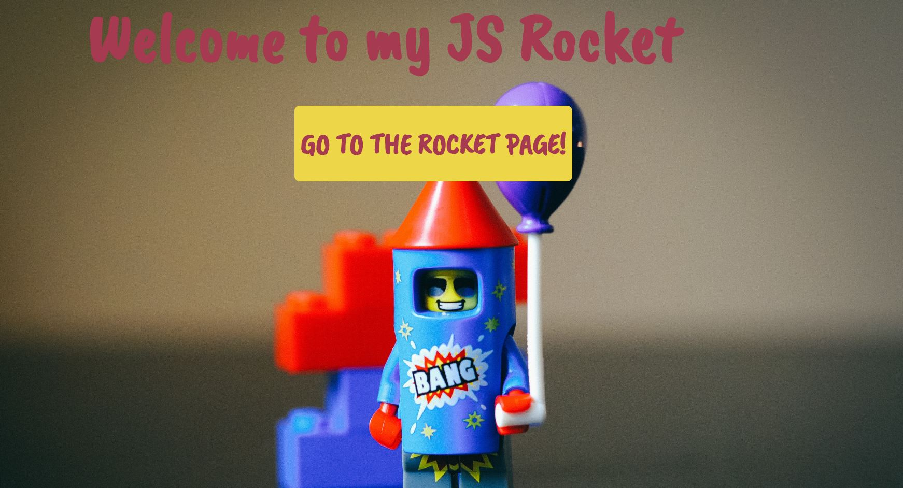
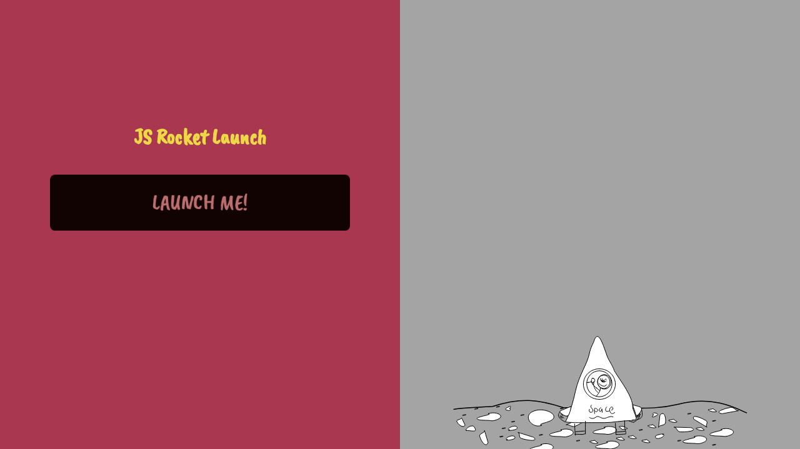

# Rocket Launch Sequence 🚀 🚀
---

## Project Objective
- Build a rocket launch sequence with HTML and CSS & Vanilla JavaScript

The assignment will give you a structured environment to learn, play and test things out. You’ll learn what all the slashes, dots, braces, brackets and funny words mean. And you’ll also learn about some advanced CSS properties and CSS transitions.

***

## Requirements
#### Requirement Number One:
- A launch button.
- A CSS styled rocket.

#### Requirement Number Two: 
- A rocket that launches upwards.
- A countdown sequence.

#### Requirement Number Three: 
- A programmed random chance of failure.

## Project Thumbnails:

